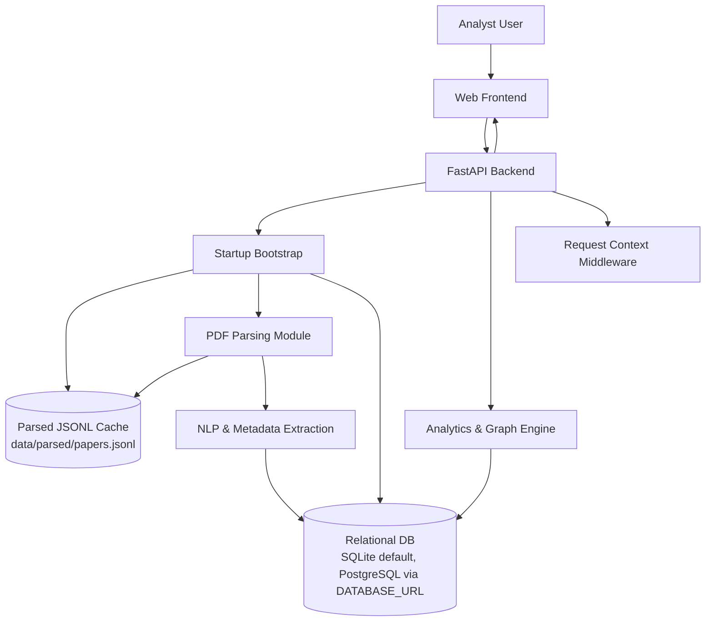
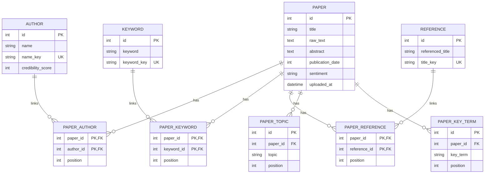
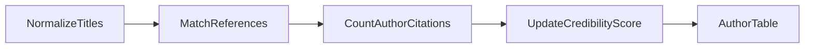
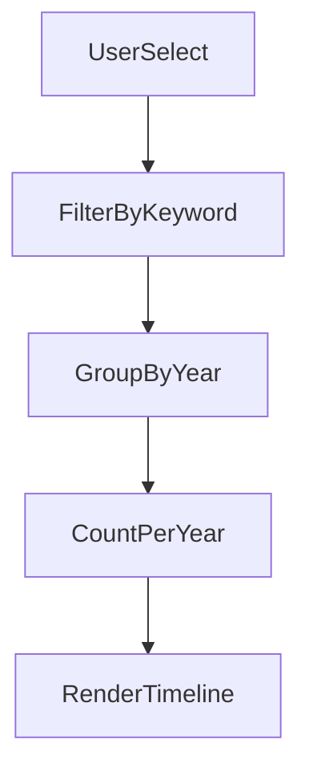

# CoreHub Knowledge Analytics System
## Design Specification (Version 1.3)

---

# 1. High-Level System Architecture

Meaning:
- Frontend calls the FastAPI backend; startup bootstrap synchronizes PDF-derived cache data and reloads relational DB state before serving analytics queries.
- NLP extraction writes structured entities to DB, while middleware attaches request-level context metadata for responses.

Justification:
- This separates ingestion/bootstrap concerns from query-time analytics and keeps runtime API behavior consistent across SQLite/PostgreSQL.

---

# 2. Data Model

Meaning:
- `PAPER` is the core entity; authors/keywords/references are normalized into separate tables and linked through association tables.
- `PAPER_TOPIC` and `PAPER_KEY_TERM` keep extracted analytics labels while `position` retains list ordering from ingestion.

Justification:
- The model avoids duplicate entity rows, preserves stable relationships for graph/timeline APIs, and supports efficient filtering.

### Notes
- `publication_date` is stored as a year (`int`) to match extraction output.
- `name_key`, `keyword_key`, and `title_key` are lowercased normalized keys used for deduplication and filtering.
- `position` preserves list ordering from ingestion for authors, keywords, references, topics, and key terms.
- Runtime storage uses SQLAlchemy repository (`create_repository`) with `DATABASE_URL`; default fallback is `sqlite:///./data/corehub.db`.
- Parsed dataset cache `data/parsed/papers.jsonl` remains ingestion/bootstrap artifact; API query state is persisted in the relational DB.
- Current schema bootstrap is `Base.metadata.create_all(...)`; formal migration tooling is not yet integrated.

---

# 3. Credibility Computation

Meaning:
- Titles and references are normalized, matched heuristically, and citation matches are aggregated per author.
- Aggregated counts are written back to `author.credibility_score`.

Justification:
- This provides a deterministic, lightweight credibility metric directly from ingested corpus references.

---

# 4. Keyword Evolution Timeline

Meaning:
- The timeline path applies keyword filtering on papers, groups matched records by publication year, and emits sparse yearly counts for rendering.

Justification:
- Sparse yearly output keeps payloads small and matches frontend charting needs without artificial zero-fill rows.

---

*End of Version 1.3 Design Specification*
