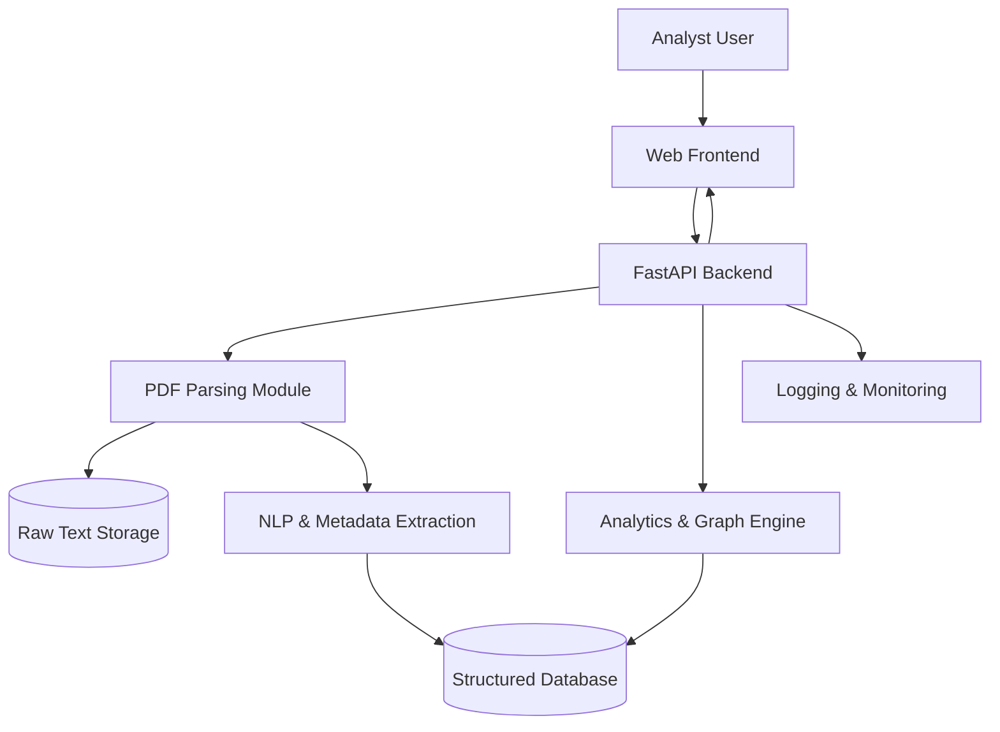
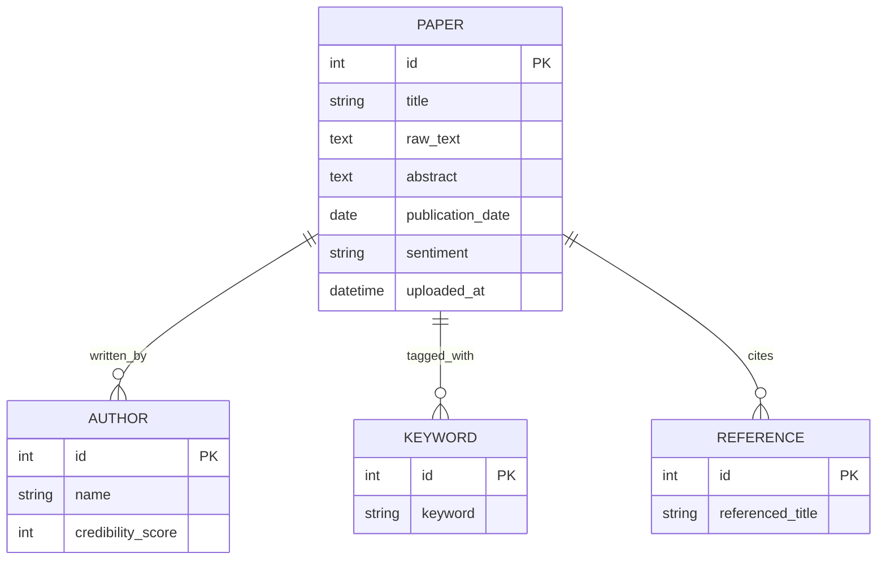
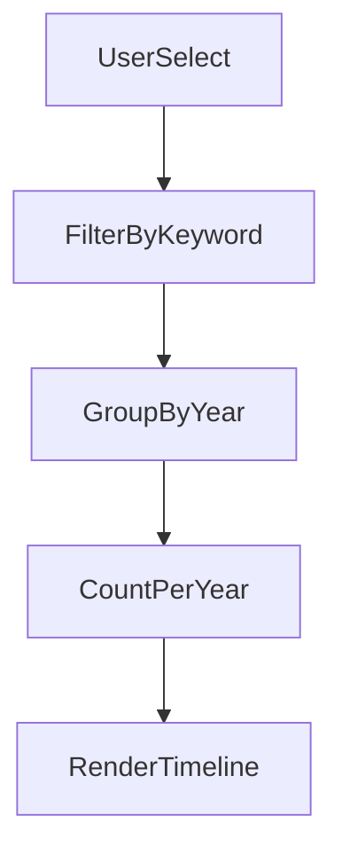

# CoreHub Knowledge Analytics System
## Design Specification (Version 1.1)

---

# 1. High-Level System Architecture

---

# 2. Data Model

---

# 3. Credibility Computation

---

# 4. Keyword/Topic Evolution Timeline

---

*End of Version 1.1 Design Specification*
